# Synapse

A polished, ChatGPT-style desktop chat client for local [Ollama](https://ollama.com) models with optional OpenAI, Anthropic, and OpenRouter cloud API support. Run LLMs on your own hardware or connect to cloud providers — your choice.


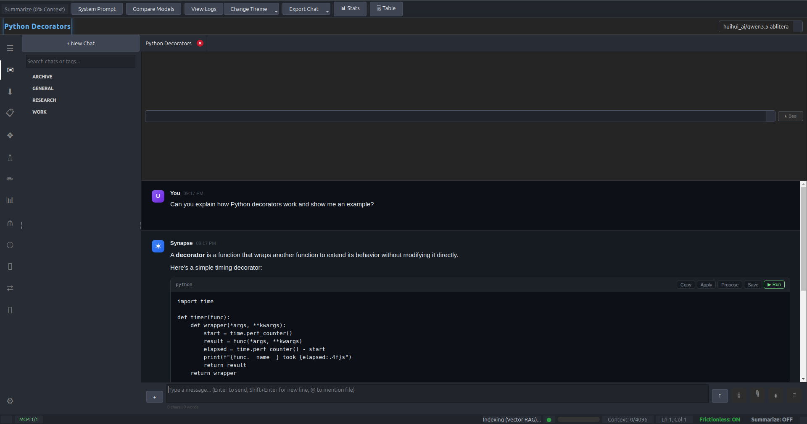

---

## Why Synapse?

Most local LLM interfaces are either terminal-only or bloated Electron apps. Synapse is a lightweight, native desktop client that gives you the ChatGPT experience with models running entirely on your own GPU — with features the terminal can't match.

| Feature | Terminal (`ollama run`) | Synapse |
|---|---|---|
| Conversation history | Per-session only | Persistent across sessions |
| Multiple conversations | No | Tabbed chats + sidebar with search |
| Model switching | Restart required | Dropdown + auto VRAM unload |
| Cloud APIs | No | OpenAI, Anthropic, OpenRouter |
| Markdown / code blocks | Raw text | Live-rendered with syntax highlighting |
| Math rendering | No | LaTeX via KaTeX |
| Diagrams | No | Mermaid flowcharts, sequence, ER, Gantt |
| Image support | No | Multimodal (paste, drag-drop, file picker) |
| Image generation | No | Stable Diffusion, ComfyUI, DALL-E 3 |
| System prompts | Manual prefix | Presets + template library + personas |
| Tool use | No | Built-in tools + MCP server support |
| Code execution | No | Sandboxed Python interpreter |
| Model management | Terminal commands | Pull, delete, HuggingFace browser |
| Workspace | No | File browser, editor, terminal, git panel |
| Analytics | No | Token usage, costs, model breakdown |
| Scheduled tasks | No | Cron-style automated prompts |
| Model comparison | No | Arena (blind A/B), Prompt Lab, Playground |
| Voice | No | Whisper STT + TTS |
| Knowledge/RAG | No | Workspace indexing + YouTube transcripts |

## Features

### Core Chat
- **Multi-Model Support** — Switch between any Ollama model from a dropdown. Synapse automatically unloads the previous model from VRAM before loading the new one.
- **Cloud API Support** — Connect to OpenAI (GPT-4, o1, o3), Anthropic (Claude), and OpenRouter (100+ models) alongside local Ollama models. Supports custom base URLs for Groq, Together, and other OpenAI-compatible providers.
- **Streaming Markdown** — Responses render markdown live during streaming. Code blocks, tables, and formatting appear in real-time.
- **LaTeX Math** — Inline `$...$` and display `$$...$$` math rendered via KaTeX.
- **Mermaid Diagrams** — Flowcharts, sequence diagrams, ER diagrams, and Gantt charts render as interactive SVGs.
- **Edit & Regenerate** — Edit any sent message or regenerate any response. "Retry with..." regenerates using a different model.
- **Tabbed Conversations** — Open multiple chats in tabs, drag to reorder.
- **Auto-Title** — Conversations are automatically titled by the model after the first exchange.
- **Auto-Continue** — Truncated responses are automatically continued without manual intervention.
- **Response Feedback** — Thumbs up/down on each AI response for personal tracking.
- **Drag-and-Drop Message Reordering** — Drag messages to rearrange conversation flow.

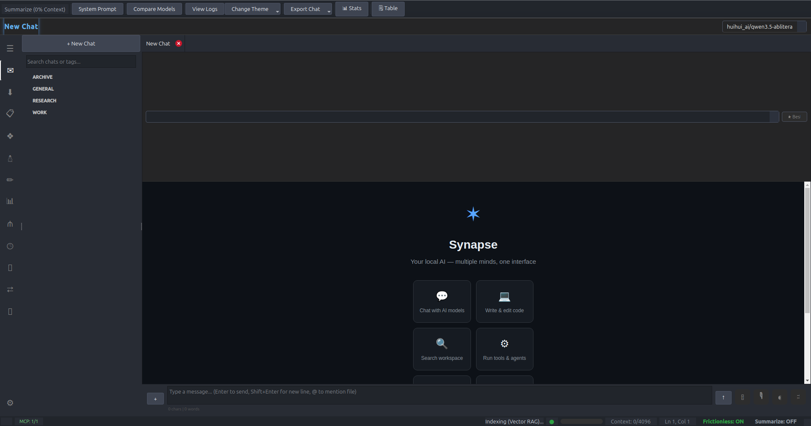

### Tool Use & MCP
- **Built-in Tools** — File read/write, command execution, web search, image generation — the model can use tools to accomplish tasks.
- **MCP (Model Context Protocol)** — Connect external tool servers (GitHub, filesystem, databases) via the MCP standard. Configure servers in Settings > MCP Servers.
- **Tool Approval** — Review and approve/reject each tool call, or enable auto-execute for trusted workflows.
- **Code Interpreter** — Execute Python code blocks directly in chat with inline output, plots, and DataFrames.
- **Three-tier Dispatch** — Built-in tools > plugins > MCP servers, with automatic routing.

### Prompt Template Library
- **Built-in Templates** — Pre-built templates across Coding, Writing, Analysis, and Research categories.
- **Custom Templates** — Create your own templates with system prompts and starter messages.
- **Prompt Variables** — Dynamic variables (`{{DATE}}`, `{{TIME}}`, `{{CLIPBOARD}}`, `{{USER_NAME}}`, `{{OS}}`, `{{MODEL}}`) in templates and system prompts.
- **Save Chat as Template** — Convert any existing conversation into a reusable template.
- **One-Click Start** — Select a template to instantly start a new conversation with the right context.

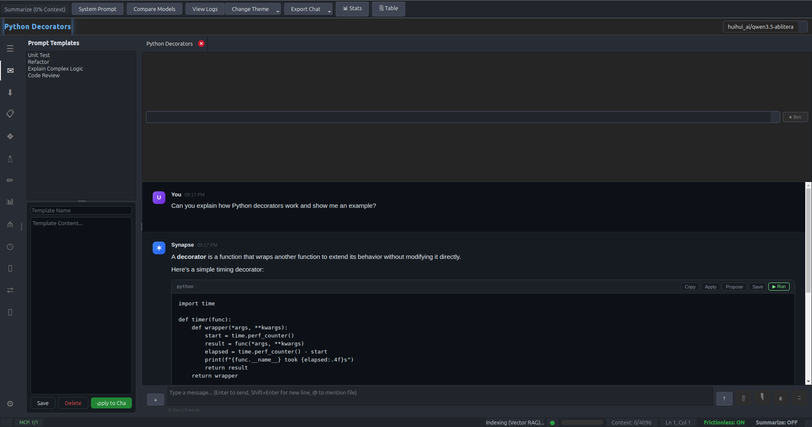

### Model Comparison & Testing

- **Model Arena (Blind A/B)** — Send a prompt to two anonymous models, vote on which is better, track ELO ratings over time.
- **Prompt Lab** — Test the same prompt across 2-4 models with different system prompts and temperatures side-by-side.
- **Model Playground** — Quick scratchpad for testing prompts — no history, no persistence.

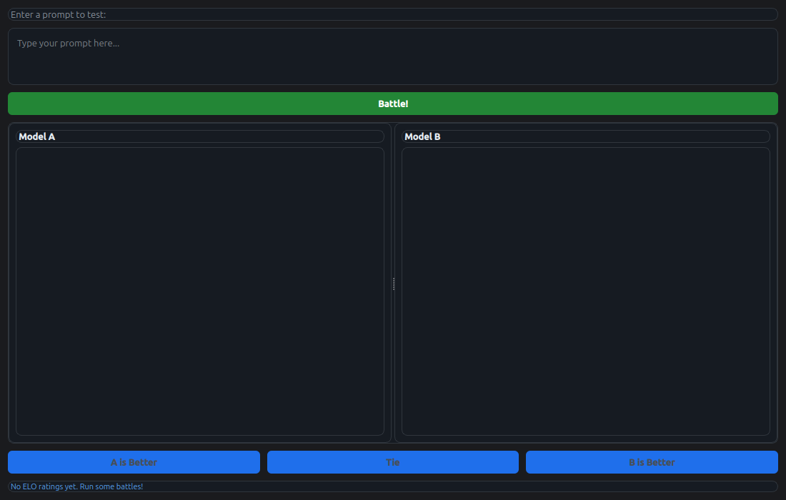
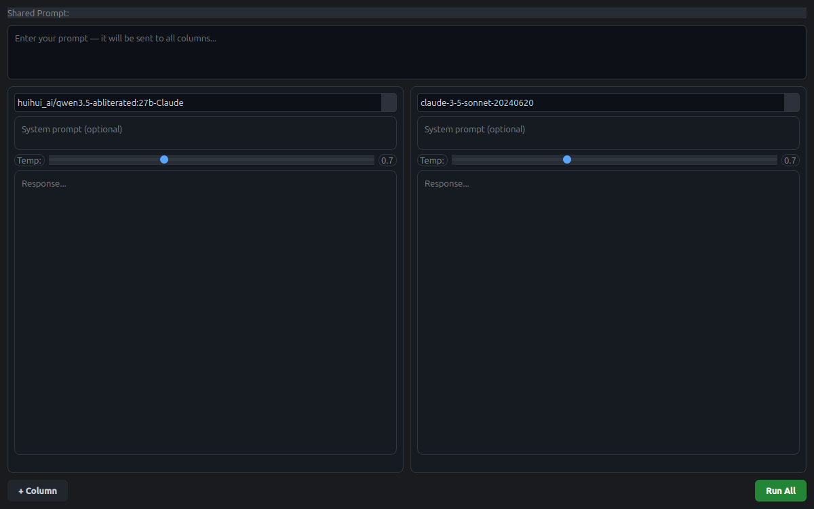
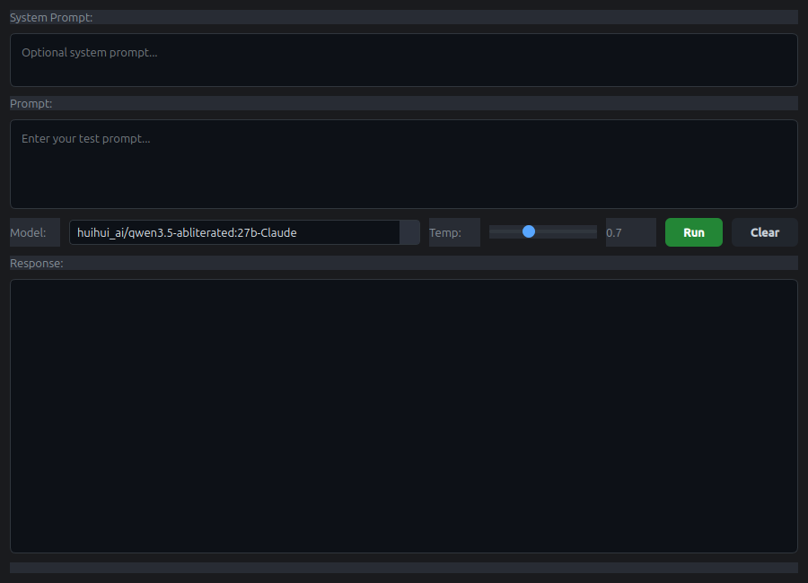

### Workspace
- **File Browser** — Browse and open project files from the sidebar.
- **Built-in Editor** — Edit files with syntax highlighting directly in Synapse.
- **Integrated Terminal** — Run commands without leaving the app.
- **Git Panel** — View status, stage files, commit, and push.
- **Workspace Search** — Full-text search across your project files.
- **RAG Context** — Workspace files are automatically indexed and injected as context when relevant.

### Knowledge & RAG
- **Workspace Indexing** — Files in your workspace are automatically chunked and embedded for retrieval.
- **YouTube Transcript RAG** — Paste a YouTube URL to fetch the transcript and ask questions about video content.

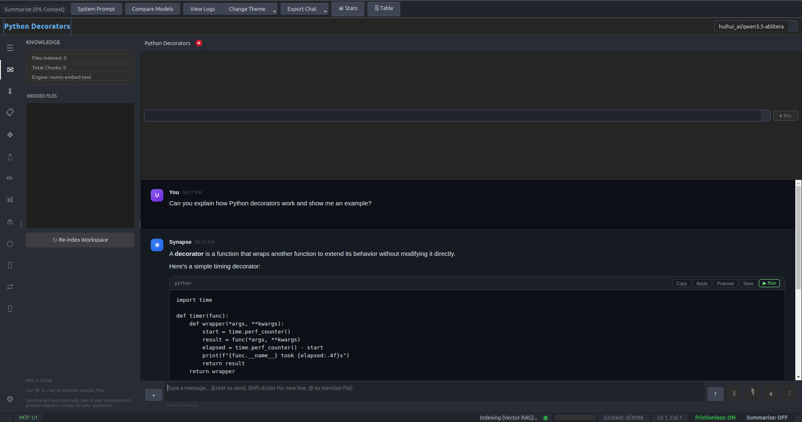

### Multimodal
- **Image Attachment** — Attach images via file picker, drag-and-drop, or Ctrl+V paste from clipboard.
- **Screenshot-to-Chat** — Capture a screen region and attach it to chat instantly.
- **Text File Context** — Drag .py, .js, .md, or any text file into the chat. Contents are injected as context.

### Model Management
- **Pull Models** — Download new models from within the app with a live progress bar.
- **Delete Models** — Remove models you don't use.
- **VRAM-Aware Recommendations** — Detects your GPU VRAM and shows models that will fit, color-coded by availability.
- **HuggingFace Browser** — Search and download GGUF models directly from HuggingFace without leaving the app.
- **Whisper Model Manager** — Download and switch between Whisper STT models (tiny through large).

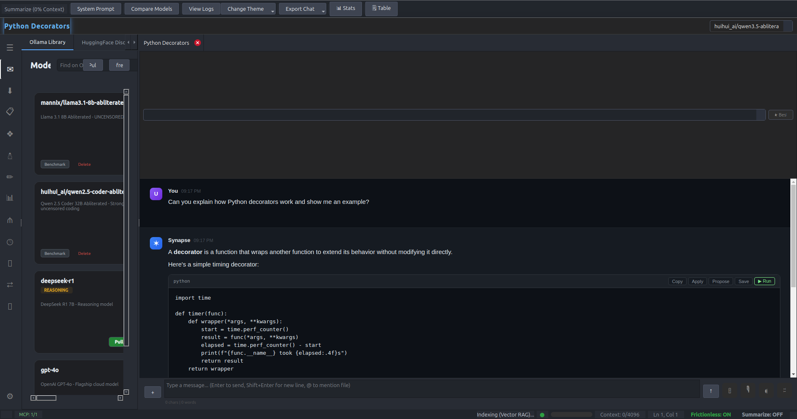

### Image Generation
- **Stable Diffusion** — Generate images via local A1111/Forge API with prompt, negative prompt, steps, CFG, and size controls.
- **ComfyUI** — Full ComfyUI workflow support with automatic polling for results.
- **DALL-E 3** — Generate images via OpenAI's DALL-E 3 API.
- **Tool Integration** — AI models can generate images via the `generate_image` tool during conversations.

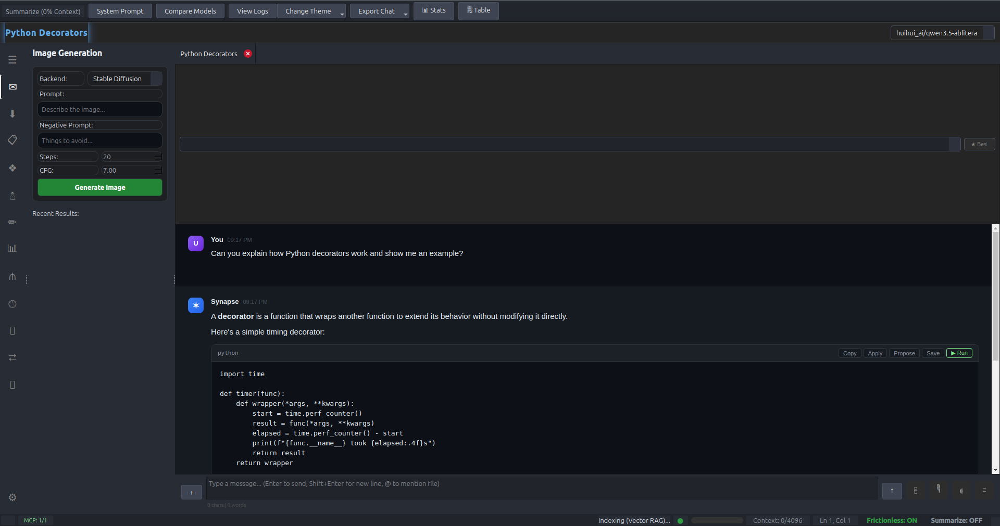

### Artifacts / Canvas
- **Live Preview** — HTML, SVG, and React/JS artifacts render in an interactive side panel.
- **Mermaid Diagrams** — Diagrams render as interactive SVGs with pan/zoom.
- **Code Execution** — Run Python artifacts via the sandboxed code interpreter.

### Analytics Dashboard
- **Usage Tracking** — Monitor token usage, message counts, and response times across all models.
- **Model Breakdown** — See which models you use most with per-model token statistics.
- **Cost Estimates** — Estimated costs for cloud API models (OpenAI, Anthropic).
- **Conversation Statistics** — Per-conversation stats: messages, tokens, response times, code blocks, models used.
- **Auto-Pruning** — Analytics data older than 90 days is automatically cleaned up.

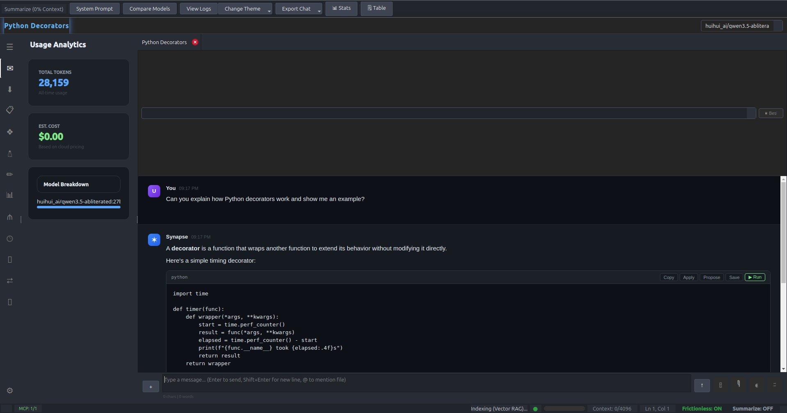

### Workflows
- **Visual Workflow Builder** — Chain prompts together: output of step 1 feeds into step 2. Drag-and-drop nodes.
- **Node Types** — Prompt, Transform, Filter, Code, and Output nodes.
- **Save/Load** — Persist workflows as JSON for reuse.

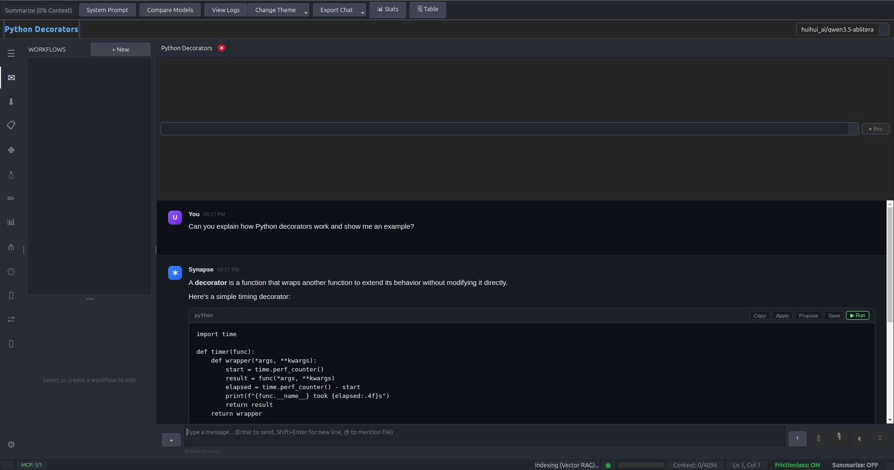

### Scheduled Agents
- **Cron-style Tasks** — Schedule prompts to run automatically on intervals (every N minutes/hours, or daily at a specific time).
- **Model Selection** — Choose which model runs each scheduled task.
- **Task History** — View results of completed scheduled tasks with tray notifications.

### Branch Tree Visualization
- **Conversation Trees** — Visualize conversation branch structure as an interactive tree diagram.
- **Node Navigation** — Click any node in the tree to jump to that point in the conversation.

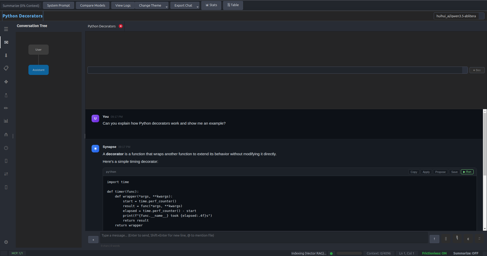

### Voice
- **Whisper STT** — Voice-to-text transcription using local Whisper models.
- **TTS Playback** — Text-to-speech for AI responses.
- **Model Manager** — Download and switch Whisper models from within the app.

### Organization
- **Folders & Tags** — Organize conversations into folders with color-coded tags. Filter by folder or tag.
- **Pin & Bookmark** — Pin conversations to the top, bookmark individual messages with notes.
- **Conversation Search** — Search across all conversations by title or content.
- **Clone & Fork** — Clone an entire conversation or fork from a specific message.
- **Compare Mode** — Compare two conversations side-by-side.
- **Import/Export** — Import JSON conversations. Export as Markdown or self-contained HTML.
- **Smart Auto-Tagging** — Automatically tag conversations by topic using the model.
- **Session Replay** — Replay a conversation's streaming in real-time for demos or review.
- **Command Palette** — Ctrl+Shift+P to quickly access any action.

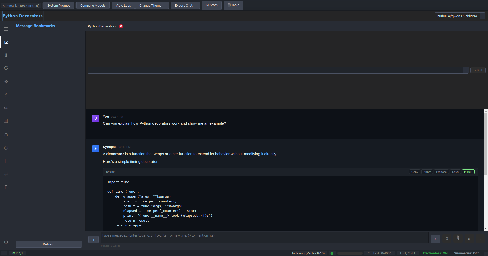

### Desktop Integration
- **System Tray** — Minimize to tray with quick access menu.
- **Quick Chat** — Floating popup from the tray icon for quick questions without opening the full window.
- **Clipboard Watcher** — Optional mode that detects copied content and offers to start a chat about it.
- **Zen Mode** — Distraction-free fullscreen chat (F11). Hides all chrome.
- **Streaming Speed Control** — Adjust response streaming speed from instant to typewriter mode.
- **Custom CSS Themes** — Import custom QSS theme files.
- **Conversation Summarization** — Generate summaries of long conversations to free context.

### Settings & Customization
- **Model Personas** — Named personas with custom avatars, system prompts, and default parameters.
- **Keyboard Shortcut Customization** — Rebind any keyboard shortcut from Settings > Shortcuts.
- **First-Run Onboarding** — Guided setup wizard for Ollama connection, model selection, and API keys.
- **Generation Parameters** — Temperature, Top P, context length, repeat penalty.
- **System Prompt Presets** — Built-in presets (Coder, Creative Writer, Concise, Analyst) plus custom presets.
- **Remote Ollama** — Connect to Ollama on another machine by configuring the server URL.
- **Notification Sound** — Optional notification when a response finishes and the window isn't focused.
- **Zoom Controls** — Ctrl+=/- to zoom the chat view.

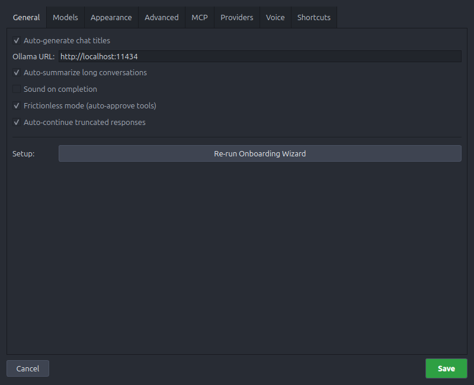
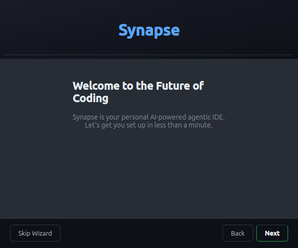

## Primary Models

These are the models I primarily use with Synapse on an RTX 4090 (24GB VRAM):

| Model | Parameters | Use Case | Tool Support |
|---|---|---|---|
| `huihui_ai/qwen3.5-abliterated:27b-Claude` | 27B | Primary — uncensored, coding + general chat | Yes |
| `huihui_ai/qwen3-coder-abliterated` | 30B | Coding-focused alternative | No |
| `qwen2.5:32b` | 32B | High-quality general purpose | Yes |
| `gemma3:27b` | 27B | Google, strong general reasoning | No |

Synapse works with **any** Ollama model. The built-in model manager recommends models based on your GPU VRAM.

## Quick Start

### Prerequisites

- Python 3.10+
- [Ollama](https://ollama.com) installed and running (`ollama serve`)
- PyQt5 and PyQtWebEngine

### Install & Run

```bash
pip install PyQt5 PyQtWebEngine markdown pygments

ollama serve

git clone https://github.com/jacobdcook/synapse.git
cd synapse
python3 -m synapse
```

### Linux Desktop Launcher

```bash
cat > ~/.local/share/applications/synapse.desktop << 'EOF'
[Desktop Entry]
Version=1.0
Type=Application
Name=Synapse
Comment=Multi-model AI chat client for local Ollama models
Exec=python3 -m synapse
Icon=chat
Terminal=false
Categories=Utility;Development;
StartupWMClass=Synapse
EOF
```

## Architecture

```
synapse/
├── __main__.py              # Entry point
├── core/
│   ├── api.py               # Multi-backend API (Ollama, OpenAI, Anthropic, OpenRouter)
│   ├── agent.py             # Tool registry & execution
│   ├── analytics.py         # Usage tracking & statistics
│   ├── code_executor.py     # Sandboxed Python code interpreter
│   ├── image_gen.py         # Stable Diffusion, ComfyUI, DALL-E 3
│   ├── memory.py            # Long-term memory for AI agents
│   ├── mcp.py               # MCP client manager (JSON-RPC over stdio)
│   ├── renderer.py          # HTML/CSS chat renderer (LaTeX, Mermaid, feedback)
│   ├── scheduler.py         # Cron-style task scheduler
│   ├── store.py             # Conversation persistence (folders, tags, bookmarks)
│   ├── indexer.py           # Workspace file indexer (RAG)
│   ├── workflow.py          # Prompt chaining engine
│   ├── voice.py             # Whisper STT + TTS
│   ├── git.py               # Git operations
│   └── plugins.py           # Plugin system
├── ui/
│   ├── main.py              # Main window & orchestration (~3100 lines)
│   ├── input.py             # Chat input with completers
│   ├── sidebar.py           # Conversation list (folders, tags, search)
│   ├── canvas.py            # Artifacts/Canvas side panel
│   ├── arena_dialog.py      # Model Arena (blind A/B testing + ELO)
│   ├── prompt_lab.py        # Multi-column prompt comparison
│   ├── playground.py        # Model playground/scratchpad
│   ├── quick_chat.py        # Floating quick chat from system tray
│   ├── bookmarks_panel.py   # Message bookmarks with notes
│   ├── screenshot.py        # Screen capture overlay
│   ├── table_editor.py      # Markdown table editor
│   ├── whisper_manager.py   # Whisper model download/management
│   ├── workflow_sidebar.py  # Workflow builder UI
│   ├── analytics_sidebar.py # Usage analytics dashboard
│   ├── template_library.py  # Prompt template browser
│   ├── onboarding.py        # First-run setup wizard
│   ├── ImageGenSidebar.py   # Image generation panel
│   ├── ScheduleSidebar.py   # Scheduled agents panel
│   ├── BranchTreeSidebar.py # Conversation tree visualization
│   ├── knowledge_sidebar.py # Knowledge/RAG panel
│   ├── model_manager.py     # Model management + HuggingFace browser
│   ├── workspace.py         # File browser panel
│   ├── editor.py            # Built-in code editor
│   ├── terminal.py          # Integrated terminal
│   ├── git_panel.py         # Git status/commit UI
│   ├── settings_dialog.py   # Settings (providers, shortcuts, MCP, voice, themes)
│   ├── command_palette.py   # Ctrl+Shift+P command palette
│   └── ...
├── utils/
│   ├── constants.py         # App constants, templates, pricing, HTML template
│   ├── themes.py            # Theme definitions
│   ├── variables.py         # Prompt variable resolver
│   ├── youtube_handler.py   # YouTube transcript fetcher
│   └── hotkey_manager.py    # Global hotkey support
└── resources/               # Icons, sounds

~/.local/share/synapse/
├── conversations/           # JSON files, one per conversation
├── analytics_v1.json        # Usage analytics data
├── arena_elo.json           # Model Arena ELO ratings
├── generated/               # AI-generated images
└── settings.json            # All settings
```

**Tech stack:**
- **PyQt5** — Native desktop widgets + QWebEngineView for chat rendering
- **QWebEngineView** — Chromium-based view for live markdown/HTML rendering
- **Ollama REST API** — Streaming chat, model management, tool calling
- **OpenAI / Anthropic / OpenRouter APIs** — Cloud model support
- **MCP** — Model Context Protocol for external tool servers
- **KaTeX** — LaTeX math rendering
- **Mermaid.js** — Diagram rendering
- **Stable Diffusion / ComfyUI / DALL-E 3** — Image generation
- **Pygments** — Syntax highlighting (Monokai theme)
- **Whisper** — Local speech-to-text

## Keyboard Shortcuts

| Shortcut | Action |
|---|---|
| `Enter` | Send message |
| `Shift+Enter` | New line |
| `Ctrl+N` | New chat |
| `Ctrl+T` | New tab |
| `Ctrl+W` | Close tab |
| `Ctrl+B` | Toggle sidebar |
| `Ctrl+Shift+P` | Command palette |
| `Ctrl+L` | Focus input |
| `Ctrl+=` | Zoom in |
| `Ctrl+-` | Zoom out |
| `Ctrl+0` | Reset zoom |
| `Ctrl+V` | Paste image from clipboard |
| `Ctrl+Z` | Undo last file edit (tool use) |
| `F11` | Zen mode (fullscreen chat) |

## License

MIT
